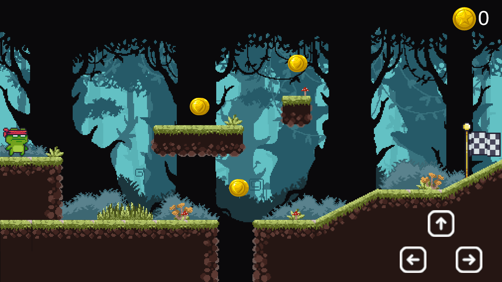

# Knight Roam 🐸

A charming 2D platformer adventure game where you control a brave frog knight collecting coins while navigating through mysterious forest landscapes. Built with Unity, this game combines pixel art aesthetics with challenging platforming mechanics.



## 🎮 Game Features

- Play as an adventurous frog character
- Collect coins throughout various levels
- Navigate through beautifully designed forest environments
- Platform-based gameplay with precise controls
- Pixel art graphics for a retro gaming feel

## 🛠️ Technical Details

- **Engine**: Unity 2022.3.28f1
- **Platform**: Windows, Mac, Linux
- **Graphics**: 2D Pixel Art
- **Resolution**: Supports Full HD (1920x1080)

## 🎨 Art Assets
Built using:
- Karisori asset package
- Pixel Adventure package

### 📹 Gameplay Preview

[Click here to watch the video](Knight%20Roam%20Promo%20-%201.mp4)

## 🔧 Installation

1. Clone the repository:
```bash
git clone https://github.com/Fusion-boy/Knight-Roam.git
```

2. Navigate to the downloaded folder and locate the executable file (`Knight Roam.exe`)

3. Double-click the executable file to start playing

## 🚧 Development Status

This game is currently in development. Features that are implemented:
- Basic movement controls (Left, Right, Up arrows)
- Coin collection system
- Level completion mechanics (checkered flag)
- Environmental hazards and platforming elements
- Score display system

## 🎯 Planned Features

- Additional levels
- More obstacles and challenges
- Enemy AI
- Power-ups
- Sound effects and background music
- Save system

## 🎓 Credits

**Developed By:** Mohamed Yaseen V M 
**Age at completion:** 14 years old  
**Game completed on:** February 17, 2025  
**Birthdate:** April 17, 2010  
**Development:** Fully self-developed using Unity and C#

---
**Note**: This game is still under development and not yet ready for public release. Screenshots and features may change in the final version.
